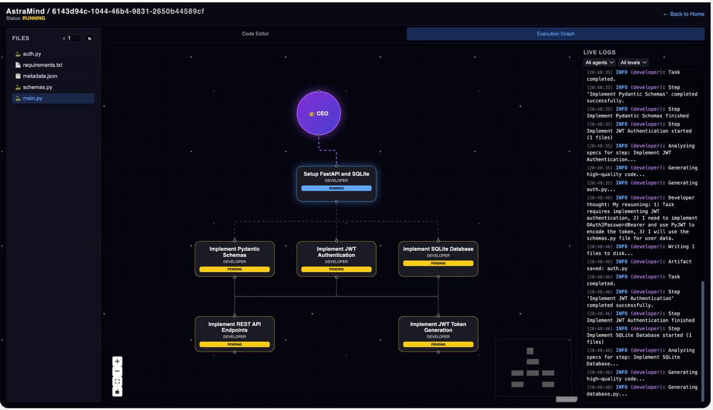
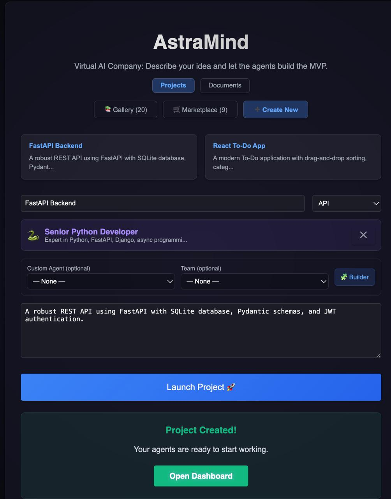
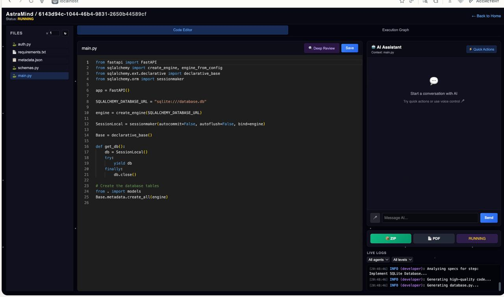

# AstraMind

**Виртуальная AI-компания: Опишите идею, и агенты создадут MVP.**

---

## 📸 Продукт в акции








---

## 🎯 Что такое AstraMind?

AstraMind — это AI-платформа для управления проектами и автономной разработки, которая превращает ваши идеи в работающие прототипы. Просто опишите свою задумку, и наша команда интеллектуальных AI-агентов позаботится обо всём:

- **Генерация кода** - Создание production-ready кода
- **Проектирование архитектуры** - Планирование масштабируемых систем
- **Тестирование и качество** - Обеспечение надёжности кода
- **Документация** - Генерация полной документации
- **Выполнение в реальном времени** - Наблюдайте за работой агентов live

---

## ✨ Ключевые возможности

### 🤖 Интеллектуальные AI-агенты
- **CEO Agent** - Управление проектом и оркестрация задач
- **Senior Python Developer** - Разработка backend API
- **Senior C++ Developer** - Системная оптимизация
- **DevOps Engineer** - Инфраструктура и развертывание
- **Technical Writer** - Генерация документации
- **LaTeX Writer** - Академическая документация
- **ГОСТ-Документатор** - Документация по ГОСТу

### 🚀 Выполнение проекта в реальном времени
Наблюдайте за графом выполнения в реальном времени, как агенты сотрудничают и завершают задачи. Каждый шаг отслеживается с подробными логами.

### 📊 Поддержка нескольких LLM
- Groq API (быстро, есть бесплатный тариф)
- OpenAI GPT модели
- DeepSeek (экономичный)
- Cerebras (высокопроизводительный)
- Поддержка локального Ollama
- GitHub Copilot

### 💼 Управление проектами
- Создание и управление несколькими проектами
- Галерея проектов (20+ шаблонов)
- Отслеживание прогресса выполнения
- Доступ к сгенерированному коду и документам

---

## 🚀 Быстрый старт

### Требования
- Python 3.11+
- Node.js 18+
- Docker & Docker Compose (опционально)

### Локальная разработка

1. **Клонирование и установка зависимостей:**
   ```bash
   git clone https://github.com/sashaai2006/AstraMind.git
   cd AstraMind
   make init
   ```

2. **Настройка окружения:**
   ```bash
   cp .env.example .env
   # Добавьте ваши API-ключи LLM в .env
   ```

3. **Запуск приложения:**
   ```bash
   make dev
   ```

4. **Доступ к приложению:**
   - Frontend: http://localhost:3000
   - Backend API: http://localhost:8000
   - API документация: http://localhost:8000/docs

### Запуск через Docker

```bash
docker-compose up --build
```

---

## 📁 Структура проекта

```
AstraMind/
├── backend/              # FastAPI backend
│   ├── agents/          # Реализация AI-агентов
│   ├── api/             # REST API endpoints
│   ├── core/            # Двигатель оркестрации
│   ├── llm/             # LLM адаптеры (Groq, OpenAI и др.)
│   ├── memory/          # База данных и векторное хранилище
│   └── sandbox/         # Песочница для выполнения кода
├── frontend/            # Next.js веб-приложение
│   └── src/
│       ├── components/  # React компоненты
│       ├── contexts/    # Управление состоянием React
│       └── pages/       # Страницы приложения
└── docker-compose.yml   # Оркестрация контейнеров
```

---

## ⚙️ Конфигурация

Создайте файл `.env` со следующим содержимым:

```env
# Выбор LLM (выберите один)
LLM_MODE=groq

# API ключи (в зависимости от LLM_MODE)
GROQ_API_KEY=ваш_api_ключ
OPENAI_API_KEY=ваш_openai_ключ
DEEPSEEK_API_KEY=ваш_deepseek_ключ
CEREBRAS_API_KEY=ваш_cerebras_ключ
GITHUB_TOKEN=ваш_github_токен

# Опциональные настройки
ENABLE_WEB_SEARCH=false
ADMIN_API_KEY=ваш_admin_ключ
```

---

## 🎓 Как это работает

1. **Опишите вашу идею** - Напишите описание проекта с техническими требованиями
2. **Выберите агентов** - Выберите, какие AI-агенты будут работать над проектом
3. **Запустите проект** - Система начнёт автономную разработку
4. **Следите за прогрессом** - Наблюдайте за графом выполнения и логами в реальном времени
5. **Получите результаты** - Скачивайте сгенерированный код, документацию и артефакты

---

## 🧪 Тестирование

```bash
make test
# или
pytest
```

---

## 🔧 Устранение неполадок

| Проблема | Решение |
|----------|----------|
| **Порт уже используется** | Измените порты в `run_dev.py` или завершите процесс на портах 3000/8000 |
| **База данных заблокирована** | Перезапустите Docker контейнеры или закройте другие подключения к БД |
| **ModuleNotFoundError** | Выполните `pip install -r requirements.txt` в активированном venv |
| **Frontend не может дотягиваться до API** | Проверьте переменную окружения `NEXT_PUBLIC_API_BASE_URL` |
| **Отсутствуют API ключи** | Установите LLM API ключи в файле `.env` |

---

## 📊 Технологический стек

### Backend
- **Фреймворк**: FastAPI (асинхронный, высокопроизводительный)
- **ORM**: SQLModel (SQLAlchemy + Pydantic)
- **Интеграция LLM**: LangChain, LiteLLM
- **Выполнение кода**: Кастомная песочница с защитой от timeout
- **База данных**: SQLite (локально), PostgreSQL (production-ready)

### Frontend
- **Фреймворк**: Next.js 14+ (React, TypeScript)
- **Стилизация**: Tailwind CSS
- **Обновления в реальном времени**: Server-Sent Events (SSE)
- **Управление состоянием**: React Context API

### Инфраструктура
- **Контейнеризация**: Docker & Docker Compose
- **Развертывание**: Cloud-ready конфигурация
- **Масштабирование**: Поддержка горизонтального масштабирования

---

## 🤝 Вклад в проект

Вклад приветствуется! Пожалуйста, следуйте существующему стилю кода и отправляйте pull request с подробным описанием.

---

## 📄 Лицензия

MIT License

---

## 🌐 Ссылки

- **GitHub**: [sashaai2006/AstraMind](https://github.com/sashaai2006/AstraMind)
- **Баги и запросы**: [Сообщить о проблеме](https://github.com/sashaai2006/AstraMind/issues)
- **Обсуждения**: [Присоединиться к сообществу](https://github.com/sashaai2006/AstraMind/discussions)

---

**Создано с ❤️ для автономной AI-разработки**
